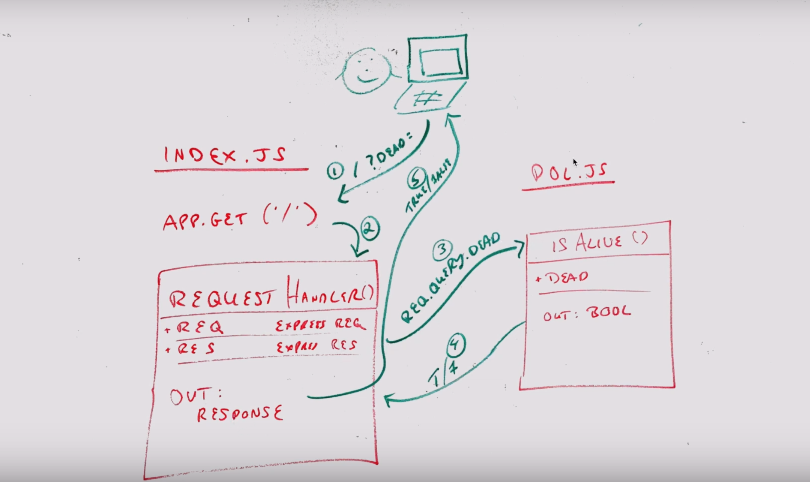

# LAB - 00

## Deployment Workshop

### Author: Clayton Jones

### Links and Resources

- [submission PR](https://github.com/claytonjones-401n16/lab-00/pull/1)
- [ci/cd](https://travis-ci.com/github/claytonjones-401n16/lab-00) (GitHub Actions)
- [front-end application](https://claytonjones-lab-00.herokuapp.com/) (when applicable)

### Documentation
- [JSDocs](https://claytonjones-lab-00.herokuapp.com/docs)

### Setup

#### `.env` requirements (where applicable)

- `PORT` - Port Number

#### How to initialize/run your application (where applicable)

- `npm start`
- Endpoint: `/`
  - Returns a boolean
- Endpoint: `/docs`
  - Returns JSDoc Documentation pages

#### How to use your library (where applicable)

#### Tests

- Unit Tests: `npm test`
- Lint Tests: `npm run lint`

#### UML

 (John's example whiteboard from DEMO)
